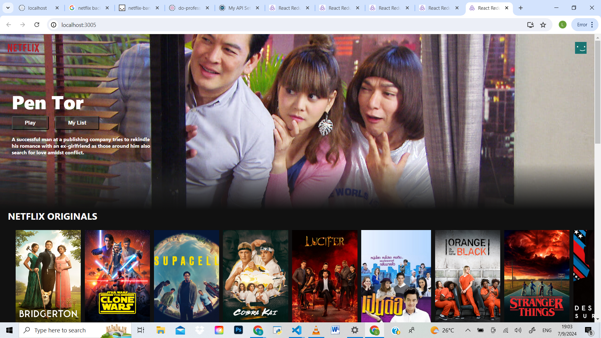
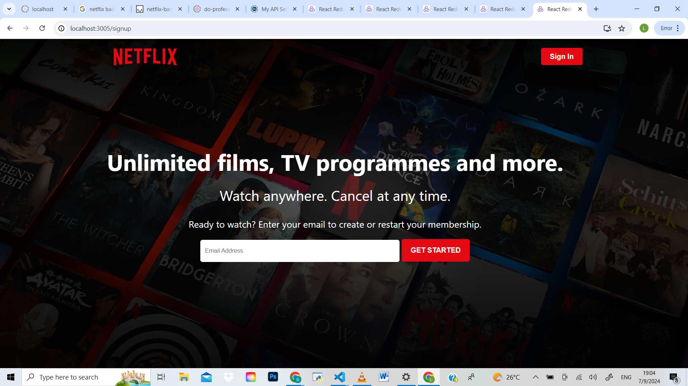

# Netflix Frontend Clone

This is a Netflix Clone built using React and Firebase for ALX SE Foundational capstone project. This project marks the end of 9 months of intensive learning and is a culmination of everything we've studied during that period.

**[Try Now](https://netflixproject-51uhc9hji-blackoligarchs-projects.vercel.app/)**

## Technologies Used

### React
React is a JavaScript library for building user interfaces. It allows us to create reusable UI components, manage the application state effectively, and efficiently update and render the right components when data changes. The component-based architecture of React helps in creating a dynamic and responsive user experience.

### Vercel
Vercel is a platform optimized for frontend developers, providing the best tools and services to deploy high-performance websites and applications. It supports static site generation, seamless integrations with various headless CMS and APIs, and provides excellent performance optimization. In this project, Vercel is used for:

- **Deployment**: Deploying the application. Vercel offers fast, secure, and reliable hosting, ensuring that the application is served efficiently to users. With features like automatic scaling and edge caching, Vercel guarantees optimal performance and availability.
- **Performance Optimization**: Enhancing application performance. Vercel's edge network and automatic optimizations ensure that the application loads quickly and efficiently, providing a seamless user experience.

## Inspiration

This project is inspired by the original Netflix application, aiming to provide a similar user experience and functionality. The goal is to practice and demonstrate the capabilities of React and Firebase in building & deploying a Frontend application.


## Screenshots

* #### Homepage View
  ===========

  
 
* #### Getting Started View
  ==============



## Getting Started

To get a local copy up and running, follow these simple steps:

### Prerequisites

Make sure you have npm and Node.js installed. Please consult your operating system's instructions on how to install Node.js and npm. For more information visit [the documentation](https://docs.npmjs.com/downloading-and-installing-node-js-and-npm)

### Installation 
   ```sh
   git clone https://github.com/BlackOligarch/netflix-project-clone.git
   cd netflix-project-clone/
   npm install
   npm start
   ```
   The above will clone the repo, get all necessary dependencies required to run the 	application and then start it. You can checkout the webapp in its full glory at `http://localhost:3000` in your web browser.
   
## Authors (REPLACE THE LINK BELOW WITH YOUR LINKEDIN)

- [Godfred Hammond](https://www.linkedin.com/in/godfredhammond/)
